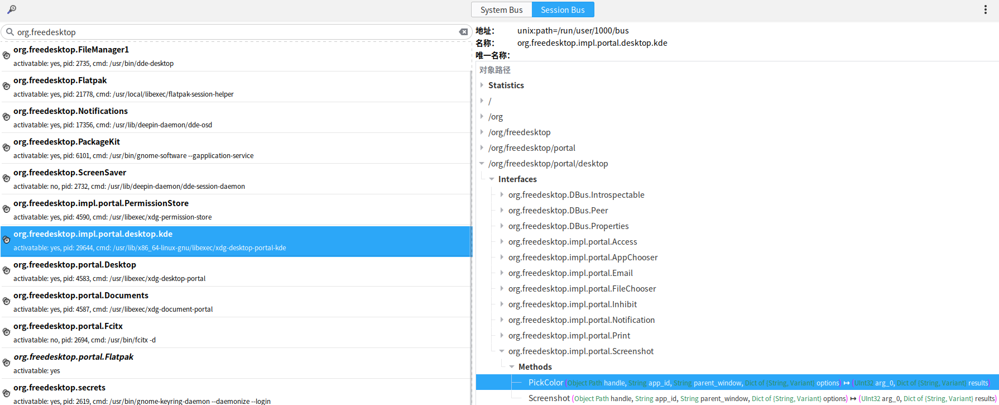
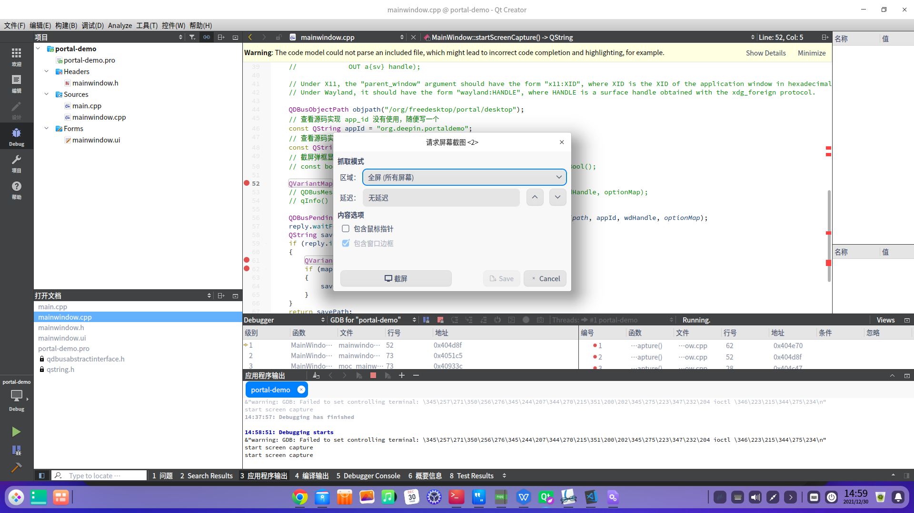

# 说明

This is a demo test for xdg-desktop-portal-kde.

demo 演示了使用qdbus 调用xdg-desktop-portal-kde提供的gdbus接口。

# 使用方式

sudo apt install xdg-desktop-portal-kde

使用d-feet工具查看系统的session bus总线如下图：

# 运行

直接使用Qt Creator调试运行。

运行结果：

# 参考文档

[https://flatpak.github.io/xdg-desktop-portal/]()

[https://github.com/flatpak/xdg-desktop-portal]()

[https://github.com/KDE/xdg-desktop-portal-kde]()

Dbus 调用方法

[https://www.cnblogs.com/brt3/p/9614899.html]()
